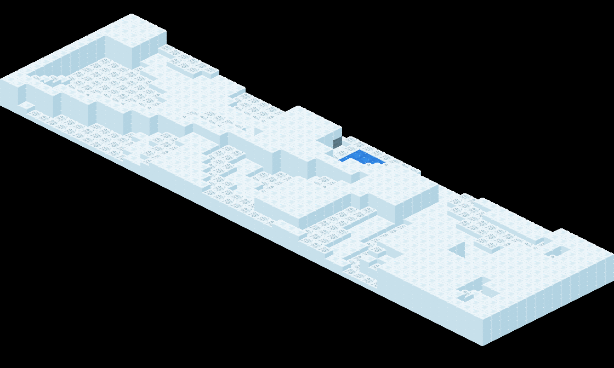
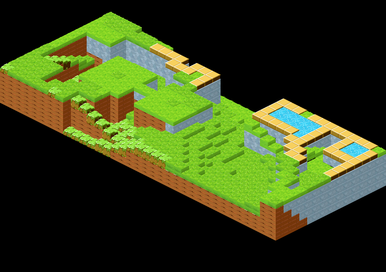
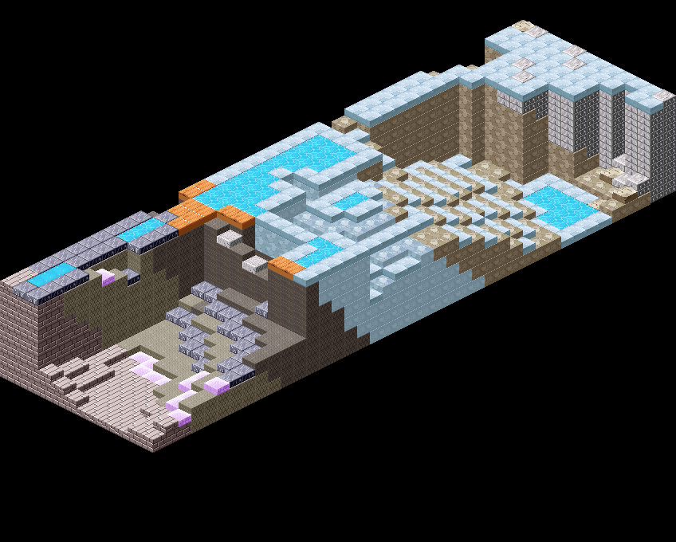

# qMapBuilder
qMapBuilderは、マップ自動生成ツールです。

オープンシンプレックス法で材質・勾配を計算し、自然なマップを無限に生成します。

adachicは、従来、qMapEditorで全てのマップを１パネルずつクラフトしていましたが、このツールを用いることにより、自動で大量のマップを生成し、その中から好きなものを選択できます。

出力形式

- png
- pngに対応するjson（qMapEditor、qEnemyGenerator互換）

以下のマップの種類に対応

- 平原／洞窟／火山／毒の沼地／雪原／城内／遺跡

使い方

- go get  github.com/adachic/qMapBuilder
- go build
- ./qMapBuilder
- outputディレクトリ以下にファイルが出力されます

出力されるマップの例

